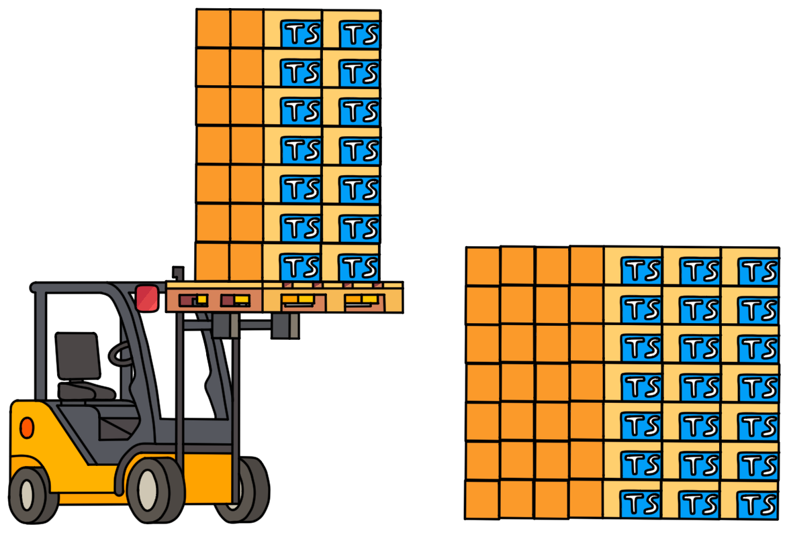

# Intro 


## Project Structure

```shell
.
├── package.json
├── packages
│   ├── foo
│   │   ├── package.json
│   │   ├── src
│   │   │   └── index.ts
│   │   ├── tsconfig.build.json
│   │   └── tsconfig.json
│   └── bar
│       ├── package.json
│       ├── src
│       │   └── index.ts
│       ├── tsconfig.build.json
│       └── tsconfig.json
├── tsconfig.build.json
└── tsconfig.json
```

## tools

- pnpm: store 
```shell
npm i -g pnpm
```
- turbo


